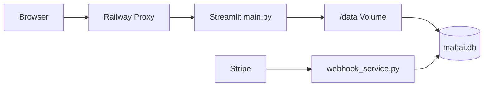

# MaByte — Infrastructure

> **Single Source of Truth** · Stand **2026-06-02**  
> Operative Details: `docs/RAILWAY_DEPLOY.md`, `ENV_SETUP.md`, `docs/API_KEYS.md`

---

## 1. Deployment-Übersicht

| Komponente | Hosting | Entry | Health |
|------------|---------|-------|--------|
| **Main App** | Railway (Docker) | `main.py` via `start.sh` | `GET /_stcore/health` |
| **Stripe Webhook** | Railway (optional, separater Service) | `webhook_service.py` | `GET /` → `ok` |
| **Datenbank** | SQLite auf Volume | `{DATA_DIR}/mabai.db` | `ensure_db_ready()` |



---

## 2. Main App (Streamlit)

### Build & Start

| Datei | Rolle |
|-------|--------|
| `Dockerfile` | Python 3.11-slim, `pip install -r requirements.txt`, `CMD sh start.sh` |
| `railway.toml` | Dockerfile builder, `startCommand = sh start.sh`, healthcheck |
| `start.sh` | `streamlit run main.py --server.port=$PORT --server.address=0.0.0.0` |
| `Procfile` | `web: sh start.sh` (Heroku-kompatibel) |
| `main.py` | PORT/ENV, DB bootstrap, `runpy.run_path(ui.py)` |

### Streamlit-Konfiguration (`.streamlit/config.toml`)

- `showSidebarNavigation = false` (eigene Sidebar in `ui/sidebar.py`)
- `enableCORS = false`, `enableXsrfProtection = false` (Railway Reverse-Proxy)
- Theme: dark, primary `#7c3aed`
- `fastReruns = true`

### Production-ENV in `main.py`

Setzt/erzwingt u. a.:

- `STREAMLIT_SERVER_ADDRESS=0.0.0.0`
- `STREAMLIT_SERVER_ENABLECORS=false`
- `STREAMLIT_SERVER_ENABLEXSRFPROTECTION=false`

---

## 3. Stripe Webhook (separater Service)

| Aspekt | Detail |
|--------|--------|
| **Datei** | `webhook_service.py` (aiohttp) |
| **Pfad** | `POST /stripe-webhook` (siehe `stripe_webhook_handler.WEBHOOK_PATH`) |
| **Start** | `python webhook_service.py` (eigener Railway-Service empfohlen) |
| **Abhängigkeit** | `STRIPE_WEBHOOK_SECRET`, gleiche `DATA_DIR`/DB wie Main App |

Main App und Webhook **teilen** SQLite — beide brauchen dasselbe `DATA_DIR` Volume bei Multi-Service-Deploy.

---

## 4. Persistenz

| Pfad | Zweck |
|------|--------|
| `DATA_DIR` (Prod: `/data`) | SQLite, Logs, Football-Cache-Dateien |
| `DATA_DIR/mabai.db` | Haupt-DB |
| `DATA_DIR/logs/` | JSON-Logs (`logger.py`) |
| `data/` (lokal) | Fallback wenn kein `/data` |

**Railway:** Volume auf `/data` mounten, `DATA_DIR=/data` setzen — sonst Datenverlust bei Redeploy.

---

## 5. Netzwerk & Domain

| Variable | Zweck |
|----------|--------|
| `APP_BASE_URL` | Öffentliche HTTPS-URL (OAuth, Stripe return) — z. B. `https://mabyte.de` |
| `PORT` | Von Railway injiziert (Default 8501 lokal) |
| Custom Domain | Railway Settings → CNAME → `APP_BASE_URL` anpassen |

**OAuth:** Redirect-URIs müssen exakt mit Google/Meta/TikTok Console übereinstimmen — siehe `docs/GOOGLE_OAUTH_SETUP.md`.

---

## 6. Pflicht-ENV (Production Checkliste)

```env
PORT=<Railway>
APP_BASE_URL=https://mabyte.de
DATA_DIR=/data
OAUTH_STATE_SECRET=<random 32+ bytes>
```

**Feature-ENV (ohne Key: Feature degradiert, kein Crash):**

| Gruppe | Variablen |
|--------|-----------|
| Auth | `GOOGLE_CLIENT_ID`, `GOOGLE_CLIENT_SECRET`, `GOOGLE_OAUTH_*` |
| AI | `OPENAI_API_KEY`, `OPENAI_*_MODEL` |
| Media | `REPLICATE_API_TOKEN`, `FAL_KEY`, `STABILITY_API_KEY`, `IMAGE_PROVIDER`, `VIDEO_PROVIDER` |
| Billing | `STRIPE_SECRET_KEY`, `STRIPE_WEBHOOK_SECRET`, `STRIPE_PRICE_*` |
| Football | `FOOTBALL_API_KEY`, `FOOTBALL_DEFAULT_SEASON`, `FOOTBALL_API_*_TTL` |
| Social | `META_*`, `TIKTOK_*`, `VIDEO_TOKEN_ENCRYPT_KEY` |

Vollständige Liste: `.env.example`, [PROJECT_STATE.md §8](PROJECT_STATE.md).

---

## 7. Externe Abhängigkeiten

| Service | Protokoll | Modul |
|---------|-----------|--------|
| API-Football | HTTPS REST | `services/football_service.py` |
| OpenAI | HTTPS REST | `pages/chat.py`, `pages/media.py` |
| Stripe | HTTPS API + Webhook | `payments.py`, `webhook_service.py` |
| Replicate / fal.ai | HTTPS | `services/video_providers/` |
| Google OAuth | OAuth 2.0 | `pages/auth.py`, `oauth_service.py` |

---

## 8. Observability

| Mechanismus | Ort |
|-------------|-----|
| Strukturierte Logs | `logger.py` → `DATA_DIR/logs/` |
| App-Fehler DB | `app_error_logs` (`db/core.py`) |
| Startup-Warnung | `main.py` wenn `APP_BASE_URL` nicht HTTPS |
| Healthcheck CLI | `python logger.py --healthcheck --http` |

Kein integriertes APM/Sentry im Repo (Stand Juni 2026).

---

## 9. Lokale Entwicklung

```bash
# Abhängigkeiten
pip install -r requirements.txt

# .env aus .env.example kopieren und Keys setzen

# App
streamlit run main.py
# oder: sh start.sh

# Football Feed Smoke (ohne UI)
python tools/test_football_feed.py
```

**Python:** 3.11 (Docker); lokal oft 3.14 — `py_compile` vor Commit empfohlen.

---

## 10. Sicherheits-Hinweise (Infra)

1. **Kein Postgres** — SQLite nur für Single-Instance oder geteiltes Volume; keine horizontale DB-Skalierung.
2. **Rate Limits in-memory** — bei mehreren Streamlit-Replicas nicht konsistent.
3. **Session in Streamlit state** — kein klassisches HttpOnly-Cookie; siehe [TECH_DEBT_REPORT.md](TECH_DEBT_REPORT.md).
4. **Secrets** — nur Railway Variables / `.env` lokal, nie ins Repo committen.

---

*Änderungen an Deploy-Pfaden: dieses Dokument + `docs/RAILWAY_DEPLOY.md` gemeinsam pflegen.*
