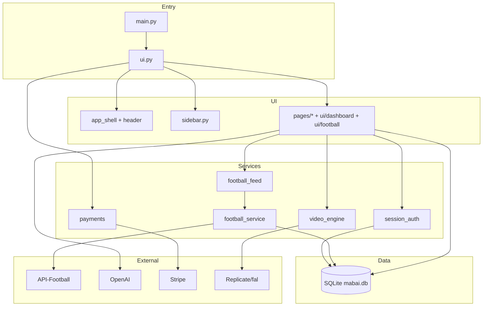

# MaByte — PROJECT_STATE

> **Single Source of Truth** für externe AI-Systeme  
> **Letzte Aktualisierung:** 2026-06-02 · Branch `main` · UI-Version **16**  
> **Einstieg:** `main.py` → `ui.py` (Streamlit)

**Verwandte Docs:** [AI_HANDOVER](AI_HANDOVER.md) · [INFRASTRUCTURE](INFRASTRUCTURE.md) · [TECH_DEBT](TECH_DEBT_REPORT.md) · [ROADMAP](ROADMAP.md) · [DECISIONS](DECISIONS.md)

---

# 1. Projektübersicht

| Feld | Inhalt |
|------|--------|
| **Projektname** | MaByte (Repo: `mab_upload` / Mab_Ai) |
| **Zweck** | B2B-SaaS „AI Operating System“ — AI-Chat, Creator-Tools (Bild/Video/Music/Code), Football Intelligence, Projekte, Automationen, Premium-Abo |
| **Stack** | Python 3.11 · Streamlit 1.50 · SQLite (`DATA_DIR/mabai.db`) · Railway Deploy |
| **Hauptfunktionen** | Auth (Passwort + Google OAuth), Token-Guthaben, Stripe Checkout, Football AI (API-Football), OpenAI/Replicate/fal Media, YouTube/Social OAuth |
| **Entwicklungsstand** | **Production Beta** (~78/100 laut `BETA_READINESS.md`) — UI/Sidebar/Football stabilisiert (Juni 2026 Rebuild) |

---

# 2. Ordnerstruktur

> Es gibt **kein** `/app`- oder `/core`-Root-Paket. Einstieg und Router liegen im Repo-Root.

```
mab_upload/
├── main.py                 # Railway/Local Entry → startet Streamlit mit ui.py
├── ui.py                   # Zentraler Router, Auth-Gate, PAGE_HANDLERS, SEO
├── ui_core.py              # Globales CSS, load_css(), require_login(), sync_session_user
├── config.py               # ENV, Pläne, Football-Ligen, Token-Kosten
├── database.py             # Facade: re-exportiert db/* (Backward-compat)
├── logger.py               # JSON-Logs nach DATA_DIR/logs
├── security.py             # Validierung, Rate-Limits (in-memory)
├── oauth_service.py        # OAuth State HMAC (Google/Meta/TikTok)
├── payments.py             # Stripe Checkout Sessions
├── pricing.py              # Token-Kostenberechnung Media
├── webhook_service.py      # Stripe Webhook (separater Railway-Service)
├── stripe_webhook_handler.py
│
├── ui/                     # UI-Schicht (HTML/CSS via st.markdown + Streamlit)
│   ├── sidebar.py          # EINZIGE Sidebar (230px, Lucide, flat nav)
│   ├── header.py           # Kompakter Topbar (64px, Logo + Claim)
│   ├── app_shell.py        # Globales CSS, Button-Styles, UI-Version
│   ├── dashboard.py        # Home / Mission Control
│   ├── football.py         # Football AI Board (Topspiele / Alle Spiele)
│   ├── components.py       # Account-Dashboard-Helpers, nav(), format_num
│   ├── styles.py           # Theme, page_layout_css, inject_css
│   ├── premium_foundation.py
│   ├── premium_cards.py
│   ├── prompt_ui.py        # Chat-Input-Styling
│   ├── video_engine_ui.py  # Video/Reels Studio UI
│   ├── ai_dashboard.py     # Shim → dashboard + components
│   └── football_betting_board.py  # Shim → ui.football
│
├── pages/                  # Streamlit-Seiten (von ui.py geroutet)
│   ├── auth.py             # Login, Register, Google OAuth
│   ├── chat.py             # AI Chat (OpenAI)
│   ├── account.py          # Profil, Limits, Aktivität
│   ├── premium.py          # Pläne, Stripe Upgrade
│   ├── projects.py         # Projekte + Memory
│   ├── automation_lab.py   # Automation-Agenten (Basis)
│   ├── media.py            # Image / Video / Music / Code Studios
│   └── social_oauth.py     # YouTube/IG/TikTok Connect Callback
│
├── services/               # Business-Logik & externe APIs
│   ├── session_auth.py     # Session-Token, Logout, enforce_active_session
│   ├── football_service.py # API-Football HTTP-Client + Cache
│   ├── football_feed.py    # Topspiele vs Alle API (STRICT whitelist)
│   ├── football_loaders.py # Filter, parse_match_card, fetch_premium_dashboard
│   ├── football_board.py   # Odds, Predictions, fetch_match_detail, Analyse-Eligibility
│   ├── football_api.py     # Re-export football_service
│   ├── football_logic.py   # Re-export feed + board
│   ├── video_engine.py     # Video-Job-Orchestrierung
│   ├── video_providers/    # Replicate, fal, OpenAI
│   ├── billing_plans.py    # Stripe/Railway Billing-Checks
│   ├── social_oauth.py     # Social Token-Verschlüsselung
│   ├── social_publish.py
│   ├── youtube_api.py
│   └── mabyte_video_brand.py
│
├── db/                     # SQLite Schema & Queries
│   ├── core.py             # init_db(), users, support, usage, payments, audit
│   ├── users.py            # Auth, Rollen, football_plan auf User
│   ├── app.py              # Projects, Automations, Leads, global_memory, Football usage
│   └── video_engine.py     # video_jobs, reels, social_connections, scheduled_posts
│
├── docs/
│   ├── ai/                 # ← AI Single Source of Truth (dieses Verzeichnis)
│   ├── RAILWAY_DEPLOY.md
│   ├── GOOGLE_OAUTH_SETUP.md
│   ├── API_KEYS.md
│   └── VIDEO_ENGINE.md
│
├── tools/
│   └── test_football_feed.py  # Smoke-Test Feed (ohne Streamlit)
│
├── assets/                 # Statische Bilder
├── scripts/                # Debug-Screenshots
├── data/                   # Lokale SQLite (wenn kein /data Volume)
├── requirements.txt
├── Dockerfile / railway.toml / Procfile / start.sh
└── .env.example
```

**Nicht vorhanden:** `pages/admin.py`, `ui/sidebar_nav.py`, separates `/components`-Paket, Frontend-JS-Bundle.

---

# 3. Seiten / Workspaces

Routing: `st.session_state.page` in `ui.py` → `PAGE_HANDLERS`.

| Seite | `page`-Key | Zweck | Status | Fertig |
|-------|------------|-------|--------|--------|
| **Dashboard** | `home` | Willkommen, Quick Actions, Tokens/Plan/Aktivität | Beta | ~85% |
| **AI Chat** | `chat` | OpenAI Chat, Projekt-Memory optional | Beta | ~80% |
| **Football AI** | `football` | Topspiele (Whitelist) / Alle API-Spiele, Analyse on-demand | Beta | ~75% |
| **Image** | `image` | Bildgenerierung (OpenAI/Stability) | Beta | ~75% |
| **Video** | `video` | Video/Reels Studio | Beta | ~70% |
| **Music** | `music` | Musik-Generierung (Provider-abhängig) | Beta | ~65% |
| **Code** | `coding` | Code-Assistant via Media-Workspace | Beta | ~70% |
| **Projects** | `projects` | Projekte, Workspace-Typen, Memory | Beta | ~75% |
| **Automations** | `automation_lab` | Agent-Karten, Automation-DB (Basis) | Beta | ~55% |
| **Profile** | `dashboard` | Account, Tageslimits, Käufe, Aktivität | Beta | ~80% |
| **Premium** | `premium` | MaByte + Football Pläne, Stripe | Beta | ~72% |

**Alias:** `reels`/`creator` → `video`, `automations` → `automation_lab` (`ui/sidebar.py` → `LEGACY_PAGE_ALIASES`).

---

# 4. Sidebar

| Aspekt | Details |
|--------|---------|
| **Datei** | `ui/sidebar.py` (einzige aktive Implementierung) |
| **Breite** | 230px (`--sb-width`) |
| **Menü** | Dashboard, AI Chat, Football AI, Image, Video, Music, Code, Projects, Automations, Profile, Premium |
| **Icons** | Lucide als inline SVG (data-URI in CSS `::before`) |
| **Footer** | User-Card (Avatar, Name, Plan) + „Abmelden“ |
| **Aktiv** | `rgba(124,58,237,.18)` + 4px linke Border `#8b5cf6`, weißer Text |
| **Inaktiv** | Transparent, dezenter Hover |
| **Import** | `ui.py`: `from ui.sidebar import render_sidebar, LEGACY_PAGE_ALIASES` |

---

# 5. Football AI

## Architektur

```
ui/football.py
  → services/football_feed.py      # resolve_topspiele / resolve_all_api
  → services/football_loaders.py   # fetch_premium_dashboard, parse_match_card
  → services/football_board.py     # fetch_match_detail, odds, predictions
  → services/football_service.py   # HTTP + Cache
```

## Topspiele (`config.FOOTBALL_TOPSPIELE_LEAGUE_IDS`)

| ID | Liga |
|----|------|
| 78 | 1. Bundesliga |
| 79 | 2. Bundesliga |
| 81 | DFB-Pokal |
| 2 | Champions League |
| 3 | Europa League |
| 848 | Conference League |
| 39 | Premier League |
| 140 | La Liga |
| 135 | Serie A |
| 61 | Ligue 1 |

**Regeln:** Max 10 Spiele · kein Raw-Fallback in Topspiele · leer → „Heute keine Topspiele verfügbar.“  
**Alle Spiele:** Nur `raw_*`, max 50, Banner „Alle API-Spiele“.

**Analyse:** Button nur bei `probe_analysis_available` (Odds oder Predictions); Detail via `fetch_match_detail` — keine Fake-Tipps.

---

# 6. Datenbank

**Engine:** SQLite · **Pfad:** `{DATA_DIR}/mabai.db` · **Init:** `database.ensure_db_ready()`

| Tabelle | Zweck |
|---------|--------|
| `users` | Accounts, Plan, Tokens, Rolle, OAuth, `football_plan` |
| `football_daily_usage` | Tageslimits API/AI/Analysen |
| `usage_logs` | Tool-Nutzung, Token-Verbrauch |
| `payments` | Stripe-Sessions |
| `redeem_codes` | Gutschein-Codes |
| `login_logs` / `audit_logs` | Login / Admin-Aktionen |
| `support_tickets` / `support_ticket_replies` | Support |
| `app_error_logs` | Fehler-Logging |
| `projects` / `project_memory` / `project_chat_memory` | Projekte |
| `automations` / `automation_runs` | Automation Lab |
| `leads` / `global_memory` | Leads / globales Memory |
| `video_jobs` / `video_outputs` / `reels` / `reel_jobs` | Creator |
| `scheduled_posts` / `social_connections` | Social |

**Session:** Streamlit `st.session_state` + `services/session_auth.py` (keine `sessions`-DB-Tabelle).

---

# 7. Services (Kurz)

| Datei | Aufgabe |
|-------|---------|
| `session_auth.py` | Login-Session, Logout, `enforce_active_session` |
| `football_service.py` | API-Football HTTP, Cache, Rate-Limit |
| `football_feed.py` | Topspiele/Alle-API Feed |
| `football_loaders.py` | Filter, Dashboard-Payload |
| `football_board.py` | Odds, Predictions, Match-Detail |
| `video_engine.py` | Video-Job-Lifecycle |
| `billing_plans.py` | Stripe/Railway Billing-Checks |
| `social_oauth.py` / `social_publish.py` / `youtube_api.py` | Social |

---

# 8. Environment

Vollständige Vorlage: `.env.example` · Betrieb: [INFRASTRUCTURE.md](INFRASTRUCTURE.md) · Keys: `docs/API_KEYS.md`

**Kritisch Production:** `DATA_DIR`, `APP_BASE_URL`, `OAUTH_STATE_SECRET`, `FOOTBALL_API_KEY`, `FOOTBALL_DEFAULT_SEASON`, `STRIPE_*`

---

# 9. Architektur (Diagramm)



---

# 10. Statistiken (Repo-Scan 2026-06-02)

| Metrik | Wert |
|--------|------|
| Python-Dateien (ohne `__pycache__`) | **59** |
| Python-Zeilen | **~17.389** |
| JS/TS / standalone CSS | **0** |
| DB-Tabellen | **23** |
| Streamlit Workspaces | **11** |
| UI-Version (`ui/app_shell.py`) | **16** |

---

# 11. Bereinigungen (erledigt)

| Entfernt | Anmerkung |
|----------|-----------|
| `ui/sidebar_nav.py` | → `ui/sidebar.py` |
| Topspiele Raw-Fallback | `football_feed` strict ID-only |
| Fake KI-Tipps / Debug-Box Football | aus `ui/football.py` |
| Date-Scan aller Ligen | → Liga-ID-Fetch only |
| Großes Slogan-Banner | → 64px Header |
| Überladenes Home | → `ui/dashboard.py` minimal |

**Shims:** `ai_dashboard.py`, `football_betting_board.py`, `football_api.py`, `football_logic.py`

---

# 12. Kurzbriefing für neue KI

**MaByte** = Streamlit-SaaS (`main.py` → `ui.py`) + SQLite. **Sidebar:** nur `ui/sidebar.py` (230px). **Football:** `football_feed.py` — Topspiele nur Whitelist-IDs, nie Raw in Topspiele. **Creator:** `pages/media.py` + `video_engine`. **Billing:** `payments.py` + Stripe.

**Nicht ohne Auftrag ändern:** Football-Whitelist, Sidebar-Struktur.

**Tests:** `python tools/test_football_feed.py` · `python -m py_compile ui/sidebar.py ui/football.py services/football_feed.py`

**Letzte relevante Commits:** `ff0a920` (stable rebuild), `2e937c1` (sidebar polish)

---

*Bei Konflikt mit älteren Docs: **dieses File + Git `main`** sind maßgeblich. Detail-Schulden/Roadmap: [TECH_DEBT_REPORT.md](TECH_DEBT_REPORT.md), [ROADMAP.md](ROADMAP.md).*
